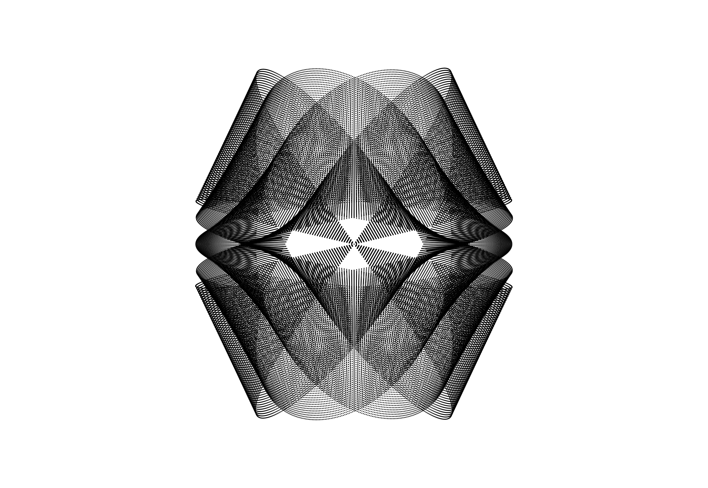
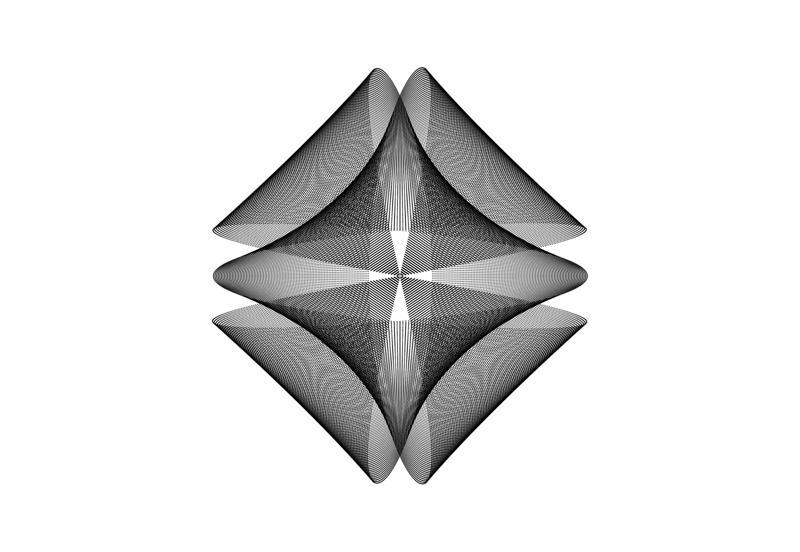
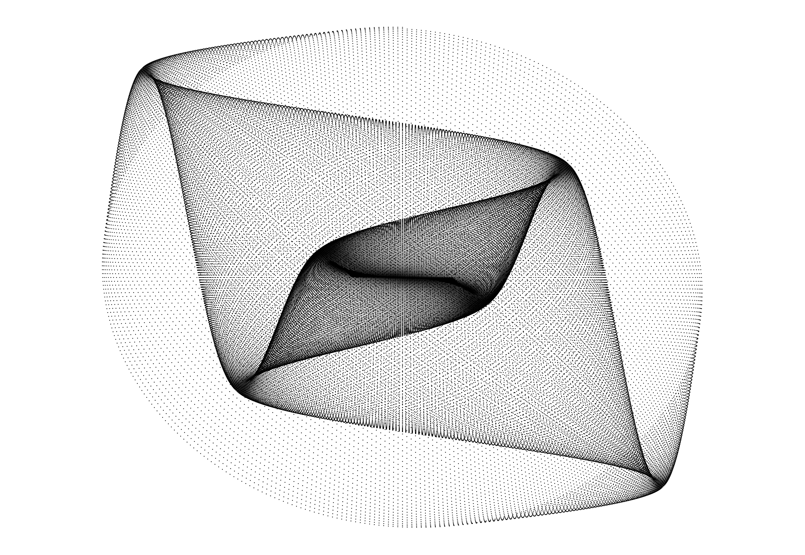

# Lissajous Curve Generator #

## Purpose

This project implements a simple Lissajous curve generator in JavaScript. Changes to the curves can be made using code, and equation parameters and generator settings can be saved or loaded as JSON files.

In order to see larger and smaller curves on-screen at once, you can zoom in and zoom out of the page, then refresh. The drawing will automatically center itself.

## About Lissajous Curves

Wikipedia: 
[Lissajous Curve](https://en.wikipedia.org/wiki/Lissajous_curve), [Harmonograph](https://en.wikipedia.org/wiki/Harmonograph)

## Files

**lissajous.js**

Generate a single Lissajous curve. Automate the changing of parameters as the drawing progresses. Generate the drawing all at once, or slowly over time. 

**animator.js**

Create an animation of multiple completed Lissajous curves. Automate the changing of parameters as the animation progresses.

## Sample Patterns

## Animator Sample Patterns

Animation where the x phase shifts over time, and color fades from blue to red over the course of generating each frame.

## Features

* Save parameters to, and load from, JSON files
* Export drawings as PNGs
* Generate drawings in realtime, adding one point at a time, starting from the beginning or choosing a later starting point
* Show or hide x and y axes
* Show or hide animated markers that track the x and y position of the point being drawn along each axis
* Each point in the drawing can store its own unique color information
* Create animations using a different fully generated curve as each frame, wherein parameters can change over time.

## To do:

* Implement feature that allows for simulating harmonographs that use rotary motion.
* Optimize the animator. It currently generates each frame in realtime before showing it, which can be slow for large drawings.